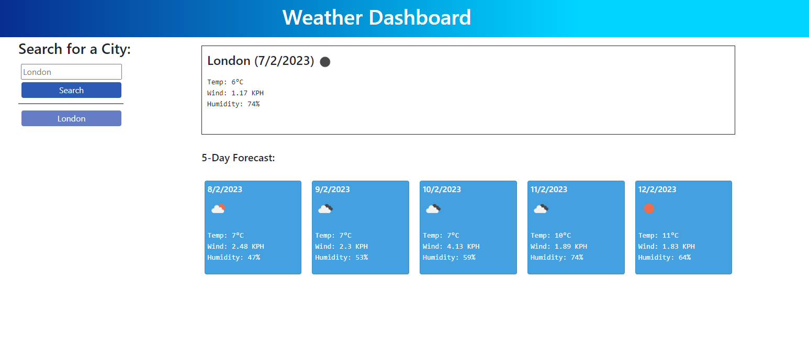

# Weather Dashboard

## Description

The application allows the user to know about the weather today and to have a 5-day forecast for the cities of their choice. 
The app features dynamically updated HTML and CSS using JavaScript and its libraries (Jquery and moment.js).
It retrieves data using the 5-Day forecast endpoint from the Open Weather API.

## Installation

N/A

## Usage

Please use this link to access the application: https://marinaongithub.github.io/weather-dashboard/

Input a city into the search bar to found out the weather there. It automatically saves and lists the cities you've searched for. Click on a city from this list for a quick access to the weather in this city!

## Credits

N/A

## License

N/A
